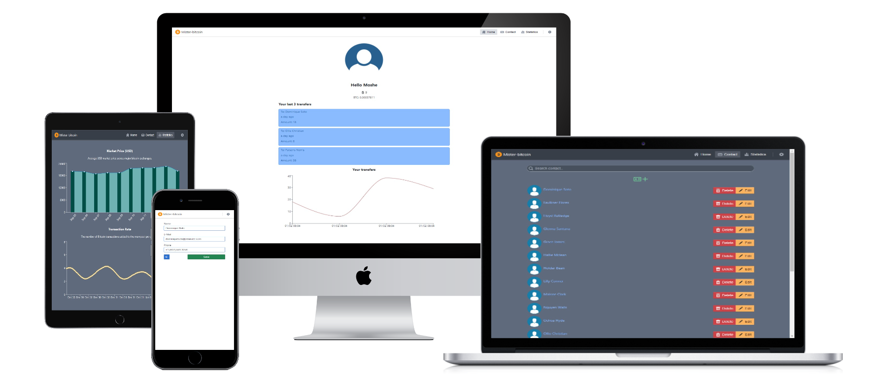

# Bitcoin-transferer

Bitcoin-transferer, A Place where user can transfer his coins with other users, manage his contacts and track his transfer coins with rich of features.  
The app using LocalStorage(DB & Server connection is yet to be!)  
**[DEMO WEBSITE](https://y-moshe.github.io/bitcoin-transferer/#/home)**

## Build with

- React
- [Blueprintjs](https://blueprintjs.com/) for UI Components
- **Redux, Redux Thunk**
- **Recharts** for Charts UI
- Transition Group for Animations
- Momentjs
- LocalStorage

## Features

- Basic user authentication
- **Dark mode** support
- Fully Responsive
- Routing using react-router v6
- CRUDL Operations
- Searching with **debounce** delay
- Charts, **Statistics** page uses External API
